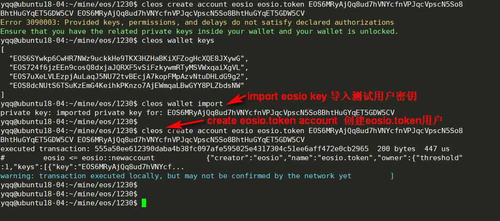
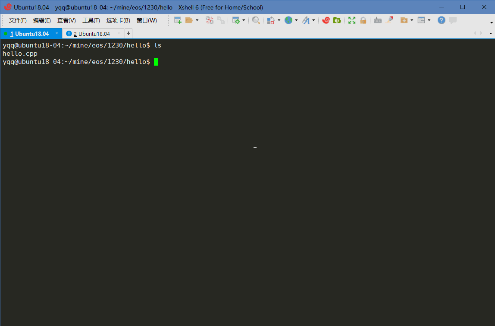

# EOS学习笔记

[TOC]


> 参考文档:  https://www.twle.cn/c/yufei/eosio/eosio-basic-contract.html

### 安装EOS

-  直接下载deb安装即可:  https://github.com/EOSIO/eos/releases

  ```
  wget https://github.com/eosio/eos/releases/download/v1.5.2/eosio_1.5.2-1-ubuntu-18.04_amd64.deb
  sudo apt install ./eosio_1.5.2-1-ubuntu-18.04_amd64.deb
  ```


### 安装编译工具cdt

- 直接下载deb安装即可: https://github.com/EOSIO/eosio.cdt/releases
- `sudo dpkg -i deb包名`安装deb包
- 使用  `eosio-cpp --version`检查是否安装成功


### EOS工具功能介绍

- nodeos : EOS节点工具, EOS核心程序

- cleos : 客户端
- keosd: 钱包密钥管理工具

- eosio-cpp: 智能合约编译工具, 将C++编译为WASM并生成ABI


### 启动节点

```
nodeos -e -p eosio --plugin eosio::chain_api_plugin --plugin eosio::history_api_plugin --contracts-console

```

>  如果出现错误: `throw database dirty flag set` , 加上`--delete-all-blocks`即可解决


### 创建钱包

```
cleos wallet create -n yqq -f eospass.txt
```

记录钱包密码(解锁和交易都需要用到):

```
PW5HpgpPxyhshPoiqzecwkUN829zBKw7m4wgqEmAdGKG2YBy3PxU4
```


### 打开钱包

```
cleos wallet open
```


### 列出钱包

```
cleos wallet list
```


### 解锁钱包

```
cleos wallet unlock
```


### 导入密钥

```
cleos create key --to-console   //创建密钥对
cleos wallet import   //导入创建出来的密钥
```

注意: 记得导入以下超级账号, 用于测试

eosio public key: `EOS6MRyAjQq8ud7hVNYcfnVPJqcVpscN5So8BhtHuGYqET5GDW5CV`
eosio private key: `5KQwrPbwdL6PhXujxW37FSSQZ1JiwsST4cqQzDeyXtP79zkvFD3`




### 创建测试账户

- 列出当前钱包密钥对 `cleos wallet private_keys`

  ```
   [[
      "EOS6SYwkp6CwHR7NWz9uckkHe9TKX3HZHaBKiXFZogHcXQE8JXywG",
      "5K8KtTwMarCCZnNY6XTp8WBvSSSJx1jMqLzLweYcDkDs56UDmdg"
    ],[
      "EOS724f6jzEEn9cosQ8dxjaJQRXF5vSiFzkywmRTyMSVWxqaiXgVL",
      "5KMq5XogpYSGED2dBES9nnG5qa1xMqDPN5cqdfwfkeAHgTmzmkB"
    ],[
      "EOS7uXeLVLEzpjAuLaqJ5NU72tvBEcjA7kopFMpAzvNtuDHLdG9g2",
      "5J7iz8Umnx8Y4URqduKqeou7GHM6G2MrS85buTDEEU8WnE9CqZr"
    ],[
      "EOS8dcNUtS6TSuKzEmG4KeihkPKnzo7AjEWmqaLBwGYY8PLZbdsNW",
      "5K1EwcNAHQ2tbRcXGHHn9nJDxxnNPAhaYT1f8SKS9fNPccfBFgV"
    ]
  ]
  ```

- 创建eosio.token账户, 指定创建者是eosio(管理员账户)

  ```
  cleos create account eosio eosio.token EOS6MRyAjQq8ud7hVNYcfnVPJqcVpscN5So8BhtHuGYqET5GDW5CV EOS6MRyAjQq8ud7hVNYcfnVPJqcVpscN5So8BhtHuGYqET5GDW5CV
  
  ```

- 创建hello账户

  ```
  cleos create account eosio hello EOS6MRyAjQq8ud7hVNYcfnVPJqcVpscN5So8BhtHuGYqET5GDW5CV EOS6MRyAjQq8ud7hVNYcfnVPJqcVpscN5So8BhtHuGYqET5GDW5CV
  ```

- 创建hi账户

  ```
  cleos create account eosio hi EOS6MRyAjQq8ud7hVNYcfnVPJqcVpscN5So8BhtHuGYqET5GDW5CV EOS6MRyAjQq8ud7hVNYcfnVPJqcVpscN5So8BhtHuGYqET5GDW5CV
  ```


### 编写合约

hello.cpp

```c++
#include <eosiolib/eosio.hpp>
#include <eosiolib/print.hpp>

using namespace eosio;

class hello : public contract {
  public:
      using contract::contract;

      [[eosio::action]]
      void hi() {
         print("Hello World");
      }
};
EOSIO_DISPATCH( hello, (hi))
```


### 编译合约

```
eosio-cpp -o hello.wasm hello.cpp --abigen
```

### 部署合约

```
cleos set contract hello ../hello -p 
```

### 运行合约

```
cleos push action hello hi '[]' -p hello@active
```

如果没有看到 ">> Hello world" ,  需要重新启动nodeos,  在启动选项中加入`--contracts-console`, 注意: 启动之后需要重新创建测试用户!!!


> 如果nodeos 重启了, 必须重新创建测试账号!! 否则也会报错: 
>
> yqq@ubuntu18-04:~/mine/eos/1230/hello$ cleos set contract hello ../hello -p 
> Failed to get existing code hash, continue without duplicate check...
> Reading WASM from /home/yqq/mine/eos/1230/hello/hello.wasm...
> Publishing contract...
> Error 3090003: Provided keys, permissions, and delays do not satisfy declared authorizations
> Ensure that you have the related private keys inside your wallet and your wallet is unlocked.


### 运行效果演示




