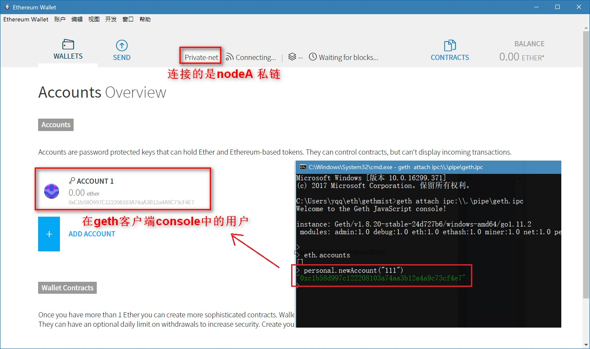
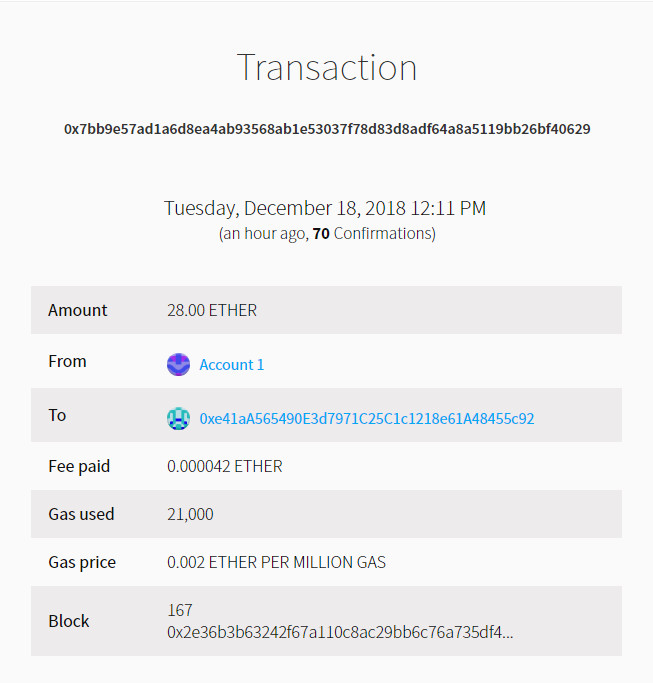

# 以太坊学习笔记

- 区块链原理演示demo

>  https://anders.com/blockchain/blockchain.html


## 使用geth搭建自己的私链(单节点)

> 请先安装geth, 并将geth添加到环境变量

- 1.在某个目录下, 这里以`C:\Users\yqq\eth\persondata`为例, 创建创世区块信息 文件genesis.json, 内容如下:

  ```json
  {
  	"config": {
  		"chainId": 15,
  		"homesteadBlock": 0,
  		"eip155Block": 0,
  		"eip158Block": 0
  	},
  	"coinbase": "0x0000000000000000000000000000000000000000",
  	"difficulty": "0x40000",
  	"extraData": "",
  	"gasLimit": "0xffffffff",
  	"nonce": "0x0000000000000042",
  	"mixhash": "0x0000000000000000000000000000000000000000000000000000000000000000",
  	"parentHash": "0x0000000000000000000000000000000000000000000000000000000000000000",
  	"timestamp": "0x00",
  	"alloc": {}
  }
  ```


- 2.初始化  `geth --datadir node1 init genesis.json`,  特别注意: 每创建一个新节点, 必须先初始化, 否则后面会各种坑!!! 

  ```
  C:\Users\yqq\eth\persondata>geth --datadir node1 init genesis.json
  INFO [12-17|23:57:12.910] Maximum peer count                       ETH=25 LES=0 total=25
  INFO [12-17|23:57:12.947] Allocated cache and file handles         database=C:\\Users\\yqq\\eth\\persondata\\node1\\geth\\chaindata cache=16 handles=16
  INFO [12-17|23:57:12.981] Writing custom genesis block
  INFO [12-17|23:57:12.984] Persisted trie from memory database      nodes=0 size=0.00B time=0s gcnodes=0 gcsize=0.00B gctime=0s livenodes=1 livesize=0.00B
  INFO [12-17|23:57:12.990] Successfully wrote genesis state         database=chaindata                                               hash=a0e580…a5e82e
  INFO [12-17|23:57:12.998] Allocated cache and file handles         database=C:\\Users\\yqq\\eth\\persondata\\node1\\geth\\lightchaindata cache=16 handles=16
  INFO [12-17|23:57:13.022] Writing custom genesis block
  INFO [12-17|23:57:13.027] Persisted trie from memory database      nodes=0 size=0.00B time=0s gcnodes=0 gcsize=0.00B gctime=0s livenodes=1 livesize=0.00B
  INFO [12-17|23:57:13.031] Successfully wrote genesis state         database=lightchaindata                                               hash=a0e580…a5e82e
  ```

- 3.打开一个cmd窗口, 启动服务器`geth --datadir node1 --ipcpath node1/geth.ipc --networkid 55 --port 10009 --nodiscover`

  ```
  --datadir  指定数据存放目录
  --ipcpath  指定ipc文件存放目录, 控制台连接时需要用到ipc文件
  --networkid    指定网络id, 如果要搭建多个节点, 必须使用同一个networkid, 否则, admin.addPeer会失败(这是我踩过的坑!!)
  --port  指定端口, 多节点必须使用不同的端口, 否则会冲突
  --nodiscover    防止被网络上其他人发现, 但是可以通过  admin.addPeer进行添加对端节点
  ```


- 4.打开另外一个cmd窗口进行连接服务器 `geth attach ipc:\\.\pipe\node1\geth.ipc`

  ```
  > eth.accounts
  []
  > personal.newAccount("111")  //创建用户, 密码是 "111"
  "0xe41aa565490e3d7971c25c1c1218e61a48455c92"
  >
  > personal.newAccount("111")
  "0x808fd82922556f0148787e3663ed0181e65c0f61"
  >
  >
  > eth.accounts  //查看用户
  ["0xe41aa565490e3d7971c25c1c1218e61a48455c92", "0x808fd82922556f0148787e3663ed0181e65c0f61"]
  >
  >
  > eth.getBalance(eth.accounts[0])
  0
  >
  > eth.coinbase  //查看挖矿人
  "0xe41aa565490e3d7971c25c1c1218e61a48455c92"
  >
  > miner.start(5)       //开启5个线程, 开始挖矿, 此时服务端开始挖矿 , 耐心等待两分钟
                      //Generating DAG in progress   epoch=1 percentage=XXX  , 当达到100%时就可以开始挖到矿了
  null
  > miner.stop()
  null
  > eth.getBalance(eth.accounts[0])
  25000000000000000000
  >
  > eth.blockNumber
  5
  >
  > eth.sendTransaction({from:eth.accounts[0], to:eth.accounts[1], value:web3.toWei(2, "ether")})  //这里需要解锁
  Error: authentication needed: password or unlock
      at web3.js:3143:20
      at web3.js:6347:15
      at web3.js:5081:36
      at <anonymous>:1:1
  
  > personal.unlockAccount(eth.accounts[0])
  Unlock account 0xe41aa565490e3d7971c25c1c1218e61a48455c92
  Passphrase:     //这里输入密码 111 即可
  true
  > eth.sendTransaction({from:eth.accounts[0], to:eth.accounts[1], value:web3.toWei(2, "ether")})
  "0x7973906595c5b3bd066c126f7f966a4d94b36c0383fc5050a85239af05ccf80a"
  >
  > txpool.status   //查看交易池中的状态, 可以看到一个交易在pending
  {
    pending: 1,
    queued: 0
  }
  >
  > miner.setEtherbase(eth.accounts[1]) //设置挖矿用户
  true
  > miner.start(5) //开始挖矿, 稍微等待, 等服务器显示挖到了矿在停止挖矿
  > eth.blockNumber
  9
  > eth.blockNumber
  9
  > eth.blockNumber
  10
  > miner.stop()
  null
  > eth.getBalance(eth.accounts[1])   
  52000021000000000000
  > web3.fromWei( eth.getBalance(eth.accounts[1]), "ether")
  52.000021       ////挖矿所得 + 交易手续费
  >
  >
  ```


- 5.总结: 经过上面几步我们实现了单个节点的挖矿+转账交易.


## 使用geth搭建自己的私链(多节点)

在上面的基础上, 我们在新建一个节点node2, 命令如下:

```
1.初始化(新建节点前必须初始化!!):  geth --datadir node2  init genesis.json
2.启动服务端: geth --datadir node2 --ipcpath node2/geth.ipc --networkid 55 --port 10010 --nodiscover //注意: --networkid 必须与node1节点保持一致!!

3.打开另外的cmd, 进行连接服务端:  geth attach ipc:\\.\pipe\node2\geth.ipc

```

### 添加节点

- node1控制台

  ```
  > admin.nodeInfo.enode   //查看本节点地址
  "enode://0e83568d7f443764ac036080f694c1278b3df6d1f507616db91fabfc4c6ce080901a9fc0ab3b9c36757b7d2743184d8bf8c0dea918988686c7447cb5e1d2ae51@163.125.179.72:10009?discport=0"
  
  ```

- node2控制台

  ```
  > personal.newAccount("111")
  "0x48e33e5121497eda40697341e405d4adb8b60984"
  >
  > eth.coinbase
  "0xd18d089990d8d6e8aeeb3965edac1df740fb749e"
  >
  > admin.peers
  []
  >
  > admin.nodeInfo
  {
    enode: "enode://72634a41f51c8c75650ec5e416daa5578edb98592ee2898cde6ac1ca50c44b14016bf0a353dbd85cf1ef42c841a06052f5d253de329c2bf5324d211d8756d0c0@163.125.179.72:10010?discport=0",
    enr: "0xf88fb8408b691c58760e023c9ab87efcec4bd9582c76b2a8f948444bf2262d4f0b0143b638d42ece43c951ccc910c3946222ead456956514e52142890ca4101af375e3f60283636170c6c5836574683f82696482763482697084a37db34889736563703235366b31a10272634a41f51c8c75650ec5e416daa5578edb98592ee2898cde6ac1ca50c44b148374637082271a",
    id: "11ef6d692fc5ce19e67767bc9661df9088031254304064808e8af5e00e3f2392",
    ip: "163.125.179.72",
    listenAddr: "[::]:10010",
    name: "Geth/v1.8.20-stable-24d727b6/windows-amd64/go1.11.2",
    ports: {
      discovery: 0,
      listener: 10010
    },
    protocols: {
      eth: {
        config: {
          chainId: 15,
          eip150Hash: "0x0000000000000000000000000000000000000000000000000000000000000000",
          eip155Block: 0,
          eip158Block: 0,
          homesteadBlock: 0
        },
        difficulty: 262144,
        genesis: "0xa0e580c6769ac3dd80894b2a256164a76b796839d2eb7f799ef6b9850ea5e82e",
        head: "0xa0e580c6769ac3dd80894b2a256164a76b796839d2eb7f799ef6b9850ea5e82e",
        network: 55
      }
    }
  }
  >
  >
  > admin.addPeer("enode://0e83568d7f443764ac036080f694c1278b3df6d1f507616db91fabfc4c6ce080901a9fc0ab3b9c36757b7d2743184d8bf8c0dea918988686c7447cb5e1d2ae51@163.125.179.72:10009?discport=0")      //添加node1
  true
  >
  > admin.peers   //可以看到, 已经添加成功
  [{
      caps: ["eth/63"],
      enode: "enode://0e83568d7f443764ac036080f694c1278b3df6d1f507616db91fabfc4c6ce080901a9fc0ab3b9c36757b7d2743184d8bf8c0dea918988686c7447cb5e1d2ae51@163.125.179.72:10009?discport=0",
      id: "6fb555a6ec8b19e3c3c1a4dd2b8a15e6f50dede36dedec6dea4bb905fd082f86",   //node1的id
      name: "Geth/v1.8.20-stable-24d727b6/windows-amd64/go1.11.2",
      network: {
        inbound: false,
        localAddress: "192.168.10.126:56674",
        remoteAddress: "163.125.179.72:10009",
        static: true,
        trusted: false
      },
      protocols: {
        eth: {
          difficulty: 3947161,
          head: "0x15df03da3ca1c75857fee397d768bb4dab3d924009984020a53fa4b642676ee5",
          version: 63
        }
      }
  }]
  >
  ```


### 转账

node1 eth.accounts[0] 向node2 eth.accounts[0]转账,  node2 eth.accounts[1] 负责挖矿.

- node1

  ```
  > eth.getBalance(user1)
  ReferenceError: 'user1' is not defined
      at <anonymous>:1:16
  
  > eth.getBalance(eth.accounts[0])
  22999979000000000000
  >
  >
  > eth.sendTransaction({from:eth.accounts[0], to:"0xd18d089990d8d6e8aeeb3965edac1df740fb749e", value:web3.toWei(15, "ether")})
  Error: authentication needed: password or unlock
      at web3.js:3143:20
      at web3.js:6347:15
      at web3.js:5081:36
      at <anonymous>:1:1
  
  > personal.unlockAccount(eth.accounts[0])
  Unlock account 0xe41aa565490e3d7971c25c1c1218e61a48455c92
  Passphrase:        //输入密码, 进行解锁
  true
  > eth.sendTransaction({from:eth.accounts[0], to:"0xd18d089990d8d6e8aeeb3965edac1df740fb749e", value:web3.toWei(15, "ether")})
  "0xb7e392e0f8edb744f9c15716e8a4f5fef1c6ce944284e7f6a23abd875b09eb75"
  > txpool.status
  {
    pending: 1,            //交易pending中
    queued: 0
  }
  > txpool.status
  {
    pending: 0,          //交易完成
    queued: 0
  }
  > eth.getBalance(eth.accounts[0])
  
  7999958000000000000         //减少了 15eth  + 一些手续费
  >
  ```

-  node2

  ```
  > admin.peers   //查看对端节点信息
  [{
      caps: ["eth/63"],
      enode: "enode://0e83568d7f443764ac036080f694c1278b3df6d1f507616db91fabfc4c6ce080901a9fc0ab3b9c36757b7d2743184d8bf8c0dea918988686c7447cb5e1d2ae51@163.125.179.72:10009?discport=0",
      id: "6fb555a6ec8b19e3c3c1a4dd2b8a15e6f50dede36dedec6dea4bb905fd082f86",  //节点1 的信息
      name: "Geth/v1.8.20-stable-24d727b6/windows-amd64/go1.11.2",
      network: {
        inbound: false,
        localAddress: "192.168.10.126:56674",
        remoteAddress: "163.125.179.72:10009",
        static: true,
        trusted: false
      },
      protocols: {
        eth: {
          difficulty: 3947161,
          head: "0x15df03da3ca1c75857fee397d768bb4dab3d924009984020a53fa4b642676ee5",
          version: 63
        }
      }
  }]
  >
  > eth.getBalance( eth.accounts[0])
  0
  > eth.accounts[0]
  "0xd18d089990d8d6e8aeeb3965edac1df740fb749e"
  >
  > txpool.status
  {
    pending: 1,    //node1的转账交易, 已经处于 pending状态, 等待矿工挖矿
    queued: 0
  }
  >
  >
  > miner.setEtherbase(eth.accounts[1])   //设置挖矿人
  true
  >
  > miner.start(5)    //开始挖矿(将交易打包), 指定开启5个线程
  null
  > miner.stop()     //停止挖矿
  null
  >
  > eth.getBalance(eth.accounts[0])
  15000000000000000000                //已经收到node1第0个用户转来的钱
  > eth.getBalance(eth.accounts[1])
  70000021000000000000                //node2节点  挖矿 + 一笔交易手续费
  >
  ```


## 踩过的坑

- 1.miner.start()之后返回null, 以为挖矿失败了, 其实服务端正在挖矿, 第一次挖矿需要等一下 , 直到 `Generating DAG in progress   epoch=1 percentage=XXX`中的percentage为100时, 才真正挖到了矿. miner.stop() 返回null, 其实也需要等待一下才真正停止挖矿.
- 2.启动服务端时两个节点的`--networkid` 设置的不一样, 导致  admin.addPeer()时总是不成功!!
- 3.window指定ipc文件和 linux指定ipc的方式不同,  window是  `\\.\\pipe\\你指定目录`请参考上面的例子;  linux实在 --datadir目录下`geth.ipc`


## geth+Mist搭建私链

- 1.关闭Mist, 在一个新目录(这里以`C:\Windows\System32\cmd.exe`为例)初始化一个新的节点 

  ```
  C:\Users\yqq\eth\gethmist>geth --datadir nodeA init genesis.json
  ```


- 2.启动节点服务端, 启动的时候指定创建ipc的路径, Mist会使用这个ipc(即`\\.\pipe\geth.ipc`)与当前节点相连

  ```
  C:\Users\yqq\eth\gethmist>geth --datadir nodeA --networkid 55 --port 10999 --nodiscover --ipcpath \\.\pipe\geth.ipc   
  ```


- 3.启动客户端console , 连接nodeA

  ```
  C:\Users\yqq\eth\gethmist>geth attach ipc:\\.\pipe\geth.ipc      //指定ipc, 连接服务端
  Welcome to the Geth JavaScript console!
  
  instance: Geth/v1.8.20-stable-24d727b6/windows-amd64/go1.11.2
   modules: admin:1.0 debug:1.0 eth:1.0 ethash:1.0 miner:1.0 net:1.0 personal:1.0 rpc:1.0 txpool:1.0 web3:1.0
  
  >
  > eth.accounts
  []
  > personal.newAccount("111")                //创建一个用户
  "0xc1b58d997c122208103a74aa3b12a4a9c73cf4e7"
  >
  ```


- 4.启动Mist, 设置网络是 Rinkeby, 如果本来是Rinkeby就不需要设置(Mist默认是Rinbkey,可以根据自己需要设置其他网络). 当Mist启动后, 可以看到刚创建的用户了, 如下图:

  


- 5.启动`C:\Users\yqq\eth\persondata`中的node1节点

  ```
  geth --datadir node1 --networkid 55 --nodiscover --port 10333 --ipcpath node1\geth.ipc
  
  geth attach ipc:\\.\pipe\node1\geth.ipc     //启动console
  ```

- 在nodeA中添加node1为对端节点, 然后, 从nodeA的账户想node1节点账户转账, 并开始挖矿, 转账结果如下: 

  


## 注意点

- 1.Mist启动时会通过会打开`\\.\pipe\geth.ipc` , 所以, 在启动nodeA节点时需要指定 `--ipcpath \\.\pipe\geth.ipc`


